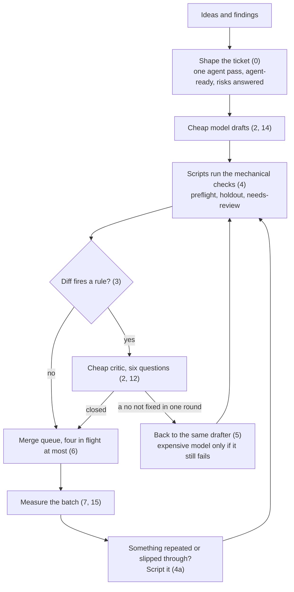
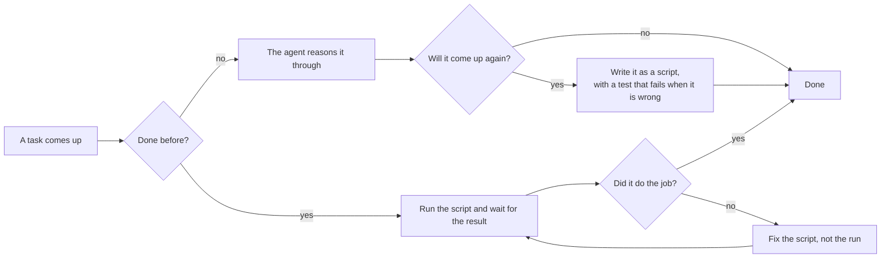
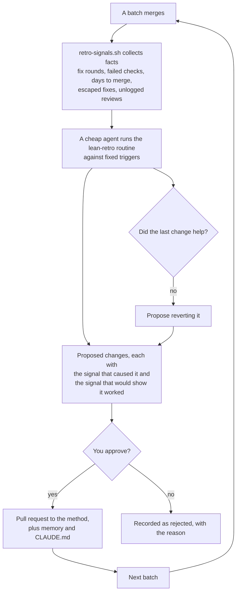

# The lean agent method

How I run AI coding agents over a ticket backlog without burning a plan in a night. Written after doing exactly that, on my own project, in September 2026. The story is in the article; this is the method.

The numbers here are mine, at list prices, on one .NET codebase. Treat them as a shape, not a benchmark.

## The short version

Shape the ticket for the agent before anyone starts: one ticket is one agent pass, written so the agent needs nothing else, with the review's questions answered in advance. A cheaper model drafts every change. Scripts, not instructions, run the mechanical checks. A cheap critic reviews every change against six fixed questions. The expensive model only sees what the critic cannot close. At most four changes in flight.

That took me from about 66 dollars of model use per change to about 25, with no drop in what got caught.

The whole loop, with the section that covers each step:



## Use it in Claude Code

This repository is a Claude Code plugin and its own marketplace:

```bash
claude plugin marketplace add arnelirobles/lean-agent-method
claude plugin install lean-agent-method@lean-agent-method
```

What you get:

- `method`, the condensed rules, loaded by the agent when it plans, files, reviews or finishes a batch. You do not call it.
- `/lean-agent-method:shape-ticket` writes an issue in the agent-ready shape from section 0, after searching for one it belongs to.
- `/lean-agent-method:adversarial-review` is the critic from section 12.
- `/lean-agent-method:lean-retro` is the retro from section 16.
- Every script in `bin/` on the agent's PATH while the plugin is enabled.
- A hook that blocks a commit, tag, pull request, issue or release whose text carries agent attribution (a `Co-Authored-By` for an AI tool, a session link, a "Generated with" line) or slop: em and en dashes, arrow glyphs, and the filler words listed in `SLOP` at the top of the script. It checks message files passed with `-F`, `--body-file` or `--notes-file` too. Attribution was the step that kept getting forgotten, which is what section 16 says turns a rule into a check. `LEAN_ALLOW_ATTRIBUTION=1` or `LEAN_ALLOW_SLOP=1` turns either half off, and `python3 hooks/public-text.py --self-test` proves it.

Everything else in this README still works without the plugin. The scripts at the root are links into `bin/`.

## 0. Shape the ticket for the agent, not for a person

My issues were written for me, or for a developer: a problem, why it matters, a rough idea of the fix. An agent reads them differently. Every issue it opens costs it the issue, the linked issues, the repository rules and the code around the change, and a backlog of small issues about one area makes it read the same files again for each one. The expensive part of a ticket is not the change. It is everything around it.

The numbers, from one day on one project. A typical pull request cost 150 to 250 thousand tokens to build, 100 to 150 thousand for the adversarial review, and 30 to 100 thousand per fix round. For a small ticket, the fixed part of that, reading, building, reviewing, merging, is most of it. The same day, a docs pass fixed 197 wrong or stale claims in about ten batched pull requests for roughly 8 thousand tokens a finding. As 197 tickets with their own agent, review and CI run each, it would have cost more than ten times as much. That was an extreme case, because the findings were tiny, but it is the mechanism.

So the front half of the loop changes.

**Refine before anyone starts.** Spend a few days asking and revising while the plan is still moving. A ticket started early gets overtaken, and a third of that docs pass was fixing claims that drifted because the work moved faster than the plan.

**Consolidate when you file, not later.** Before filing anything, search the open issues for the same area or problem. If one fits, add the new item to its checklist with its own check. Merging later costs a whole triage pass; merging now costs one search.

**One agent pass is one ticket.** Anything an agent can finish in a single focused pass, one pull request or a short stack in one repository, the same code area or the same kind of fix, reviewable together, is one ticket. One ticket per repository. Security fixes stay separate unless they are the same fix. Split only when a group is too big for one pass, because a review stays sharp only on a focused diff, and that is where the reviews found real defects.

**Write it so the agent needs nothing else.**

| Part | What goes in it |
| --- | --- |
| Goal | One sentence: what is true when it is done |
| Where | The files and code areas, so the agent does not search |
| Covers | The absorbed issues, as a checklist |
| Done when | Runnable checks: tests that fail before the fix and pass after, the preflight command, docs to update |
| Risks | The review's questions answered for this change, each with a check under Done when |
| Constraints | The repository rules that apply: contract version, public API, migrations, style |
| Out of scope | What not to touch |

**Foresee the review.** Most of what the adversarial reviews found in a day fell into categories anyone could name before a line was written:

- untrusted input reaching a URL, a header, CSS, HTML, SQL or a log, where the hostile inputs are known in advance: `//host`, `/\host`, quotes, `</style>`, `url(`, control characters;
- a bound nobody stated, on rows, upstream calls, memory, time or a cache, and what happens past it, which must never be silent;
- two writes that must commit together, and what a crash in between or a second run does;
- two runs of the same thing overlapping;
- whoever already depends on this: published packages, stored data, defaults, a contract version;
- the real target environment, which a copy does not reproduce.

The Risks row is that list, answered for the change in hand, and only the lines that apply. For a bigger ticket, one cheap agent reads the ticket and the code it touches and lists what could go wrong before anyone builds. That is one agent reading, not building, and a fraction of a code review. The review after the code still runs, because the finder and the judge have to stay separate and some defects only exist in the real diff. It just finds less, which means fewer fix rounds, and each fix round was one of the costs above.

## 1. Triage inline, no agents

Read the open issues once, yourself. Sort each into a tier and do the cheap ones by hand.

| Tier | What |
| --- | --- |
| 0 | docs, tests only, config, CI files, README sweeps |
| 1 | a feature inside one module, additive |
| 2 | core, auth, tenancy, data shape, anything reachable without a login |

Close duplicates and anything already solved by other means while you are in there. Do not file follow-ups. A review finding is fixed in the change or dropped. When one is real and cannot be fixed in the change, it goes on the checklist of the open issue that already owns that area, as section 0 says, never into a new issue of its own. A backlog that grows while you work is the failure this whole method exists to prevent.

## 2. The cascade

The cheap model drafts every tier. Before a change is opened, the preflight script runs the holdout check: the change description names the production hunk each new test depends on, the script holds that hunk out and rebuilds, and the named tests must fail. A test that passes either way is a gate failure, not a nit.

Read section 10 before you trust that paragraph. It described a script I had not written for two weeks, and the critic below answered question 1 yes over a revert that never happened.

**It answers the question when the hunk can be removed without breaking a reference to it.** Holding a hunk out is a revert, so the tree has to still compile afterwards or no test runs and the answer is inconclusive. That rules out a file the change adds outright, and it rules out a new method other code already calls. It does not rule out large hunks: one 197 line hunk held out cleanly, because what it replaced was self-contained, while a 41 line new method failed because the file called it three lines later. Size is not the predictor. Whether anything else refers to the code is.

In practice that means a change to code that already existed, which is most bug fixes and most hardening work, and not a greenfield feature. Six runs on one repository: three passed, three were inconclusive, and every inconclusive was a hunk something else referred to.

A second cheap agent, fresh context, reviews every change in a checked-out copy it can build and run. Six questions, each answered yes or no with the line that proves it:

1. Did the holdout check run, and is its output on the change? Not "was the hunk reverted", which an agent can answer from the description alone.
2. Is every new route in every inventory, with the gate the issue asked for?
3. Does every session and raw query in the change name its tenant?
4. Does every new document, event or index have a migration or an upcaster?
5. Does anything from an exception, a request or a user string reach a log or a response unexamined?
6. Does any read-then-write on a shared row, or any outbound call to a URL that is not a constant, name its lock or its bound?

The expensive model takes the branch and the critic's list only when a no is not fixed in one round, or when a tier 2 answer is unsure. It does not start over.

Your continuous integration and whatever code review bot you use still run. They confirm. They do not decide.

## 3. The diff decides whether a critic runs, not the ticket

Tier from the ticket title is wrong, because the tickets that read as small are the ones that touch auth. `needs-review.sh` prints every rule a change fires; any output means a critic runs.

The rules in the script are specific to my codebase. The categories transfer: authentication and permissions, anything anonymous, raw SQL, schema and migrations, secrets and logging, concurrency and background work, deletion and retention, build and dependency files, and a test file that removes assertions. Docs, additive fields and assertion-only test additions fire nothing.

## 4. Scripts, not instructions

Four scripts do what I used to write into every agent brief. They live in the repository and are public:

- `scripts/preflight.sh` builds, runs the named test classes, checks the changelog and module versions, restores in locked mode before building so a stale lock file cannot pass, fails when a test filter matches zero tests, scans added lines including untracked files for house style, and parses any changed workflow file with a duplicate-key-rejecting parser.
- `scripts/sync-master.sh` merges the default branch, regenerates lock files when a project file changed, and reports conflicts.
- `scripts/needs-review.sh` prints the rules above.
- `scripts/strip-asset-provenance.py` removes embedded provenance metadata from images, and fails the build in `--check` mode if any is left. Section 9 is why.
- `interaction-surface.sh`, in this repository, prints what a diff touches that it did not write. Section 13 is why.
- `agent-hygiene.sh`, in this repository, reports what parallel agents leave behind: stuck wait loops, orphaned servers, scratchpad collisions, worktrees on merged branches. Section 14a is why.
- `retro-signals.sh`, in this repository, collects the facts a retro starts from. Section 16 is why.
- `bump-version.sh`, in this repository, moves a Node package's version including the two lock file fields that belong to it and none that do not. Three bumps in one day went wrong in three different ways, which is one more than care can be expected to cover.

They are in [BaryoDev/barakoCMS](https://github.com/BaryoDev/barakoCMS) under `scripts/`. Copy the shape, replace the checks with your own.

One trap worth inheriting along with the shape: `needs-review.sh` takes no arguments and diffs the working tree, folding untracked files in as new. That is deliberate, because a rule that only reads committed changes misses the file an agent has written and not yet added. It also means running it in a checkout full of other work walks all of that too. Run it inside a clean copy of the branch. I lost a few minutes to this before writing it down.

An instruction in a prompt is forgotten within a day. A script is not, and it costs no tokens to obey.

## 4a. The second time an agent reasons its way through something, it becomes a script

Section 4 moved the checks I kept writing into briefs into scripts. The same rule goes further: anything an agent works out by reasoning, and then needs again, gets written down as something that runs.

The first time, the agent spends tokens understanding the problem: how to land a stack of pull requests safely, how to cut a site over with a rollback, how to run a workflow's jobs without the hosted runner. The second time, if nothing was written down, it spends them again, and gets a slightly different answer. Written as a script, the next agent runs one command, waits, and reads the result. The tokens are spent once, on writing it.



**Where the script goes decides who benefits.** A script that works on any repository (landing a stack of pull requests, collecting retro signals, a wait with a deadline, the hygiene sweep) goes to this repository as a pull request, with its test and a line in section 4's list, and every project uses it from here. A script that knows one repository's layout or rules (its preflight, a site's cutover) goes to that repository's `scripts/`; if part of it is general, that part comes here too. Either way it arrives as a pull request, gets the same adversarial review as any change, and a person merges it. Nothing is pushed straight to the default branch of this repository or any other.

Three rules keep it honest:

- **The script gets a test.** A script that passes having done nothing is worse than a brief, because it looks finished. The stack-landing script in 14d stopped the landing twice for a reason that turned out to be its own bug, and the local runner in 14g got three things wrong until it had tests.
- **Fix the script, not the run.** When a script is wrong, correcting its output by hand this once means the next agent meets the same bug. Change the script and run it again.
- **It stops at the first surprise and says so.** A script cannot judge what it was not written for, so it checks its assumptions, stops when one fails, and names the failure. Deciding what to do then is the part that stays with a person or an agent.

This is what site reliability engineering calls eliminating toil, and what operations people call a runbook written as code. With agents it matters more, because the reasoning is the expensive part, and it is exactly the part a script lets you skip.

Examples from one day: landing a stack of seven pull requests (14d), a production cutover with backups, confirmations and a tested rollback (14f), running a repository's workflow locally when its CI minutes ran out (14g), and the holdout and preflight checks that run on every change (2, 4).

## 5. Send work back to the agent that did it

A review finding, a failed build or a conflict goes back to the agent that wrote the change, not to a new one. It still holds the context. A fresh agent re-reads the codebase to reach the same conclusion, and pays for the reading.

I measured this rather than assuming it. Resuming a drafter to make a two-line fix its reviewer had asked for cost about 4 thousand tokens. The same agent's first pass, which included reading the repository, had cost 154 thousand. The saving is not marginal.

There is a second reason, which matters more than the money. The agent that wrote the change knows what it already checked. A new one does not, so it either re-checks everything or, more often, assumes the first agent got the basics right and looks only at what you pointed it at.

## 6. Four changes in flight

The merge queue takes one change at a time and re-tests each against everything before it. Ten in flight means every later one gets brought up to date, re-tested, and sometimes repaired. That rework costs more than the parallelism saved.

## 7. Measure every batch

`workflow-cost.py` reads the per-agent transcripts a Claude Code workflow leaves behind, sums tokens by model, prices them, and prints cost per change against a baseline.

```
python3 workflow-cost.py <run-id> --prs 4 --baseline-per-pr 66
```

Point it at a run directory or a bare run id. Prices are list prices in the `PRICES` table at the top; edit them to whatever you actually pay. This and `asset-provenance.py` are the two files here you can use unmodified.

After each batch, compare two things: cost per change, and what the critic caught versus what got past it. When the critic misses something, the fix is a new scripted check, not a more expensive critic. When a critic finds nothing on a tier for three batches, drop it from that tier.

## 8. Attack your own method

My first version of this escalated to the expensive model only when the automated checks failed. I tested that against the twelve real defects the expensive reviewers had caught that week, and every one of them was, by definition, something the checks had not noticed. The rule would have called in the strong model zero times for the things that mattered.

That is why the critic runs on every change now, and why the holdout check was written. Run your own version of that test before you trust any of this, and note that attacking the method is what eventually found that the holdout check had never run at all.

Be honest about the ceiling while you are at it. Nine of those twelve defects would still pass the holdout check, because a check cannot see what a test does not test. It closes the other three, the tests that pass either way. It does not replace the critic.

## 9. Your checks read text. Half of what an agent makes is not text.

A change that swapped the icons on fourteen published packages went through the cascade above and came out clean. Every script passed. The reviewers then found that each exported image carried an embedded provenance manifest naming the tool that generated it, signed, about five and a half kilobytes of it, and that the build packed those images into every package. It was one merge away from being published under my name on a public registry.

Nothing in the method could have caught it. The house style scan reads the text of a diff. An image is not text, so it was a blind spot by construction, not by oversight. Every check I had was pointed at the half of the output I could read.

Three things came out of it that transfer to any project where agents produce files rather than only code.

**Gate the bytes.** A script now walks each image and fails the build if it finds provenance metadata: in a PNG that is an optional named chunk, in an SVG a metadata element holding a signed blob, in a JPEG a segment near the front. Detection is cheap. `strings file.png | grep -i c2pa` is enough to tell you whether you have this problem right now, and most people who generate assets do.

`asset-provenance.py` in this repo is that script. It walks a whole tree, parses each container, and exits 1 if it finds anything that is not picture data: a C2PA manifest or a text chunk in a PNG, an EXIF, XMP or C2PA chunk in a WebP, an APP1 or APP11 segment in a JPEG, a metadata element or an editor namespace in an SVG, and bytes appended past the end of any of them. A PNG chunk it does not recognise counts as a finding too, so a provenance format that does not exist yet still trips it.

```
python3 asset-provenance.py .            # scan, exit 1 on a finding
python3 asset-provenance.py . --strip    # remove what it found, in place
```

Put it wherever your other checks run. In a Node project that is one line in each of two scripts:

```
"test":     "... && python3 asset-provenance.py .",
"prebuild": "... && python3 asset-provenance.py ."
```

**Filter, do not re-encode.** The obvious fix is to run everything through an image tool with a strip flag. That works and it rewrites every pixel, which changes the file hash. If any of your evidence is a hash, and mine was, you have just invalidated it and you will not notice. Dropping the optional chunks and leaving the rest alone keeps the image data identical byte for byte. Verify it: parse the result, check the checksums, compare the compressed image stream before and after.

`--strip` copies the chunks that are the picture and drops the rest, so the compressed stream is never rewritten. It proves that before it writes: it hashes the image data before and after and refuses the write if they differ. Planting a 5.5 KB C2PA manifest into a real shipped asset and stripping it again returned a file byte for byte identical to the original. SVG is the exception. It is text, so the script reports it and leaves the edit to you rather than guessing at your XML.

**Scan the whole repository, not the diff.** I pointed the new check at every asset rather than only the changed ones. It immediately found a file that had carried a screenshot's camera metadata since the day it was committed, months earlier. A check scoped to the diff would never have seen it, and that is true of every check scoped to the diff.

The general form: list what your agents produce that your checks cannot read. Images, generated documents, lock files, fixtures, anything binary. That list is your exposure, and it is invisible in exactly the way that matters, because everything looks green.

One process note, since it nearly cost me the fix. The change was in the merge queue when I found this, and a queued branch cannot be pushed to. I had to pull it out of the queue first. Whatever your equivalent is, know how to do it before you need to, because the window is however long the queue takes.

## 10. A check that passes having checked nothing

Every recurring failure I have had this year is one shape. Not a check that fails when it should
not. A check that reports success without having checked anything, because silence and success look
identical and nobody investigates a pass.

I had two in one afternoon, on a release that was otherwise ready.

**The preflight script passed having run no tests.** It takes the test classes to run as arguments.
Given none, it did the restore, the build and every file scan, then printed `all checks passed`. I
read that line, believed it, and pushed. CI caught the real problem eighteen minutes later.

What makes this worth writing down is that the same script already refused the identical hole one
level down: a named class matching zero tests was treated as a failure, with a comment explaining
that a filter matching nothing still "finishes cleanly, exit 0". The reasoning was right and was
applied one level too shallow. The fix is six lines.

```bash
if [ ${#classes[@]} -eq 0 ] && [ "$no_tests" -eq 0 ]; then
  echo "no -class given, so no test would run and this would pass having tested nothing."
  exit 1
fi
```

**Nothing compared three files that pin the same version.** A release moves a version in one file
and the others are forgotten. An integration test caught it, correctly, eighteen minutes into CI.
The test was doing its job. Nothing was doing the job of saying so before the build.
`check-pinned-values.sh` in this repository is the general form: give it file and capture pairs and
it fails with a diff.

Note what I did not do. The test that caught it pins the version as a literal on purpose, so that
bumping the constant is a conscious act rather than something carried along automatically. Deleting
it to stop the noise would have removed the only thing that noticed. The new check runs earlier; it
does not replace it.

**The general form.** For every check you own, ask what it does when handed nothing to do. Not what
it does when it finds a problem, which is the case you designed and tested. A test runner given an
empty filter. A linter given no files. A scanner pointed at a directory that moved. A comparison
where both sides are empty strings, which are equal. Each of those exits 0, and an exit code of 0
is the only thing anyone reads.

Then make it fail before you trust it. Revert the fix and watch the gate go red, or feed the check
the exact mistake it exists to catch. Both of the gates above were written that way, and testing
the empty-capture case is what found that two unreadable files would have compared equal and passed.
That is the bug this whole section is about, sitting inside its own fix.

**The worst one I have had was a check that did not exist.** Section 2 above has described a
mutation check since early September: name the production line a test depends on, revert it, the
test must fail. Question 1 of the critic's list asked whether that had happened. For two weeks
critics answered yes.

There was no script. The preflight file had no revert step and no hunk parsing, and not one of the
last forty merged changes carried a binding. The check I wrote to catch gates that cannot fail was
one, and it had the strongest possible output: a reviewer affirming it in writing, on every change.

Two things in that are worth more than the fix.

**An item phrased as a fact can be answered from the description.** "Was the mutation reverted" is
a claim about the world that a reader satisfies by believing the change description. "Did the
holdout check run, and is its output here" names an artefact that either exists or does not. Phrase
every checklist item as the second kind. If an item can be satisfied by an opinion, it will be.

**Nothing found it. A person did**, reading the script against the document that described it. When
the answer to "what caught this" is a name rather than a mechanism, the mechanism is the finding.

The replacement holds a hunk out in a throwaway copy, rebuilds, and requires the named test to
fail, then restores and requires it to pass. One decision in it matters more than the rest:
**a held-out tree that does not compile is inconclusive, not a pass.** Reverting one hunk of a typed
language usually breaks the build, and a tree that does not build runs no tests. Score that as
success and the gate is green forever over a check that never ran, which is this section's bug
reappearing inside the fix for this section's bug. It also fails on an unclaimed hunk, so a change
that tests nothing has to say so in writing next to the diff rather than simply staying quiet.

It ships with a fixture suite that runs a known one-hunk change past eleven cases, every failure
path included, and preflight fails if any of them stops returning its exit code.

**What running it has actually shown, after nine runs on one repository.** Cost was 24 to 62 seconds
per binding, two builds and two test runs included, integration tests on containers at the top of
that range. I had expected minutes and had written slowness down as the thing most likely to kill
it. It is not.

Of the six runs against real merged changes, three passed and three were inconclusive. A pass is
worth reading precisely: the named tests failed while their hunk was held out and passed again once
it was restored, so the test does depend on the code it claims to. Three of three inconclusives were
the same cause, a hunk that something else referred to, so reverting it did not compile and no test
ran.

It caught one false binding, on a change I built to be catchable: a line that could never execute,
with a test bound to it that passed either way. One catch in nine runs, and the eight others were
either honest passes or inconclusive. That is not evidence it finds defects in the wild. It is
evidence the mechanism does what it says when the question can be asked.

Running it found four defects in itself and one thing it had never supported. It resolved the
repository from its own file path, so a copy run from anywhere else reported a git error for what
was a path bug. It spent two builds discovering that a whole-file hunk cannot be held out, which the
diff header says for free. It reported a stopped Docker as a broken branch. It said "all bindings
held out and failed as required" on a change where every hunk was declared untested and nothing had
been held out, which is this whole document's bug appearing inside its own fix. And it never parsed
the `none:` declaration, although the change that introduced it put `none:` in its own description.
Five findings, none of them from review, all of them from use.

Nine runs is not twenty, and only six were against changes I did not write for the purpose. The
number that would make me delete it still stands: twenty with no catch, or more than half coming
back inconclusive.

## 11. The machine has a ceiling too

Section 6 caps changes in flight because of the merge queue. There is a second ceiling, and it is
the machine the agents run on.

On 13 September 2026 I had thirteen agents running at once on a three core, 16 GB box. Every brief
was reasonable on its own. Five of them were building the same .NET solution and starting Postgres
containers for integration tests; the rest were installing npm packages and driving Playwright.
Load average reached 44. The same box serves live sites. They held up, the static site still
answered in about a tenth of a second, but that was down to what those sites are, not to any plan.

Nothing in this method said how many agents a machine can carry, because I had only ever measured
tokens. Cost per change looked fine. The cost that was climbing was not on the bill.

**Check before you fan out.** `nproc` and `uptime`, before the first agent starts, not after the
fans do.

**Queue the heavy commands, not the agents.** Reading code and writing a change is cheap. Compiling,
installing packages, starting containers and running a browser is what saturates a machine. So let
every agent run, and put only those commands in a queue: one lane per toolchain, one command per
lane. A .NET build and an npm install can overlap; two builds cannot.

**Run agent work at the lowest priority.** `nice -n 19` means a live service wins every contest for
CPU. For processes already running, `renice` does the same without restarting anything.

**Stop build servers from lingering.** MSBuild keeps worker nodes alive after a build for the next
one. With several agents that is a dozen idle processes holding memory. `-nodeReuse:false` makes
them exit.

After lowering the priority of what was running and putting the builds in a queue, load roughly
halved within a few minutes. Two agents finishing in that window helped, so I will not claim the
whole drop for the fix.

The mistake worth naming is how I first applied it. I sent the rule to twelve running agents as a
message. That is the instruction form section 4 warns against: it has to reach every agent, and the
next one I start will not have it. `heavy.sh` in this repository is the script form.

```
bash heavy.sh dotnet dotnet build MySolution.sln -nodeReuse:false
bash heavy.sh node   npm ci
```

It takes a lane lock with `flock`, runs the command under `nice -n 19`, says so when it is waiting,
and fails when handed no command instead of taking the lock and exiting 0. Name it once in the
agent brief; the queue does the rest.

The first version of that script had a bug the same night. It took the lock with a plain `flock`,
so every process the command started inherited the lock. `dotnet build` starts the Roslyn compiler
server, which stays up for minutes after the build exits, and it kept the lock the whole time. Four
agents waited about ten minutes on a lane where nothing was running. `flock -o` closes the lock
before the command starts, so only the command itself holds it. The test that proved it: a job
that leaves a 6 second child running made the next job wait 6.0 seconds before the change and 0.0
after, while two jobs in the same lane still took 4.0 seconds for two 2 second sleeps.

The general form is the one from section 10. A lock that is released when its holder exits is only
as reliable as your knowledge of every process that can become its holder.

## 12. The critic is a skill, and it argues with itself

The critic in section 2 is now a Claude Code skill: [`skills/adversarial-review`](skills/adversarial-review/SKILL.md). Copy the folder into `.claude/skills/` in a repository, or into `~/.claude/skills/` to use it everywhere.

Two changes made it better than the brief I used to paste.

**The finder is never the judge.** One fresh agent hunts for defects against the six questions, a contract question and the repository's own rules file. A second fresh agent, which never sees the first one's reasoning, tries to prove each finding wrong: it looks for the guard elsewhere, confirms the change caused it, and runs the smallest check that settles it. Only survivors are reported. A reviewer that scores its own findings keeps the confident ones, and confident is not the same as right.

**The repository's rules come first.** A review bot does not know that a stricter validation is a breaking change here, that a console refuses an API whose contract version it does not list, or that nothing hashed from a secret may sit in a publicly readable record. On one night in September 2026 a bot caught a stale cache timestamp, a webhook replay check in the wrong order and a missing timeout, and missed two pull requests that would have locked every released console out of the next API. The critic caught those two because the rules file lists each consumer and the version range it accepts. Keep a `docs/review-rules.md` per repository; `review-rules.example.md` shows the shape.

Run both. The bot is good at general stability and correctness patterns; the critic is good at what only this codebase knows. `log-review.sh` appends one line per review so section 7's comparison has numbers, and a category the critic keeps confirming becomes a scripted check.

## 13. Every finding is an interaction, so look there before you push

In one run in September 2026, agent-made pull requests across three repositories went through the critic and a review bot. Over the first five, every defect that survived verification was an interaction between two things and not one was a defect inside the thing the agent built.

- A diagnostic route supplied a query scope the page route does not pass, so it reported a binding as resolving that the live page leaves unbound.
- A purge generation expired after a day, while a cache entry with the backstop turned off never expires, so a container could fall back onto a key another one still held.
- A replay claim was written before the purge it claimed, so a store that threw left the retry told the work was done.
- Animated blocks were correct on screen and empty to a screen reader, because the only text in the accessibility tree was hidden by the animation.

That is not carelessness and it will not go to zero. An agent has whole context on what it builds and partial context on what it calls. The tests it writes cover what it thought of, which by definition excludes what it did not.

So the target is not fewer findings. It is earlier ones. A finding caught after the push costs push, CI, review, fix, push, CI again. The same finding caught before the push costs one local test run. On a .NET repository where the test job is twenty-five minutes, that is the difference between an hour and a minute.

`interaction-surface.sh` prints the part the agent did not think of. For a diff it answers two questions: which unchanged files use a symbol the diff defines, and which unchanged files import a changed file. It finds candidates, it does not judge them. For each entry the author must produce one of two things before pushing: a test that crosses that boundary, or a sentence saying why that caller is unaffected. An entry with neither is where the critic finds its next defect.

```
./interaction-surface.sh origin/master      # a branch
./interaction-surface.sh --wip              # uncommitted work
```

I checked it against a case whose answer I already knew. The pull request that added per-collection settings changed `src/related.ts` and left `src/screens/post-view.tsx` alone. The script names that exact pair. The defect that escaped that pull request was in that exact pair, and it was fixed two pull requests later. One local run, before the push, would have put it in front of the author.

Two callers deserve a second look whatever the list says, because both produced real defects above while every test passed: a path that reads configuration the change also reads, and a path that runs when the change fails rather than when it succeeds.

### What the sixth pull request did to that claim

The next change through was bigger than the five before it, and it broke the pattern. Six findings: three were interactions, a search control pointing at a route that cannot read a query, one of two code paths clamping a limit while the other did not, and a fallback that survived for the default configuration but not a replaced one. The other three were defects inside the new code, an unfiltered read, an unvalidated repeated query parameter, and a fixture linking to a page nothing served.

So the honest claim is most, not all, and it thins out as a change gets larger and carries more new surface of its own. A tool aimed at interactions cannot reach the other half, and nothing here should be sold as if it can.

The same run gave the tool its first real use and two corrections worth taking. The author ran it after pushing rather than before, so it was not a clean test of whether it reduces findings. It printed fifteen symbol groups over fifty files, of which about half were pure name collisions, a local called `order` in one module matching an unrelated local of the same name elsewhere. The fix was to match exported declarations only rather than exported or top level: a caller cannot depend on what it cannot reach, so a name nothing exports is not a boundary. On the same branch that took fifteen groups down to three, and two of the three were the exact surface the change was about.

The author's own verdict is the part worth keeping. Reading fifty entries to find three worth acting on still beat a review round trip, but the value was not the file list. It was the two questions at the end, which are prompts rather than search results, and which produced the two tests that were missing: a scope that could shadow a tenant's own field name, and a read whose failure must not throw because it would break a consumer's build. It also surfaced one thing that would otherwise have shipped, a second copy of a mapping that the change had just made redundant.

A list of files is cheap to generate and expensive to read. A short list of questions about the boundary is the opposite. Weight accordingly.

### The second run, used properly, and the answer is no

The next change ran it before pushing rather than after, which is the test the first one could not be. It did not reduce review findings.

That change drew fourteen findings from elsewhere: three from the code scanner on regular expressions that stripped scripts, ten from an adversarial reviewer, and one from the review bot. The script found one thing, a latent name collision between two files in the same directory exporting the same two type names, which nothing imported together yet. It prompted five tests that are worth having. It did not find a single one of the fourteen.

Two of those fourteen were serious and neither was reachable from a file list. A block named for sticking never stuck, because every block is wrapped in a div exactly as tall as its contents and a sticky element cannot move outside its containing block; measured, its top went from 0 to minus 400 after a 400 pixel scroll, and no test or screenshot could see it because the look check captures at rest. And a test runner checked that something answered on a port rather than that the thing answering was the process it had just started, so a stale server would have passed the whole suite.

The author's own summary was that every bug that mattered came from somewhere else.

So, honestly:

- **The import half earns its place.** Which unchanged files import a file you changed was useful on both runs. It is a small list and every entry is a real dependency.
- **The symbol half did not, until it was narrowed.** Before matching exported declarations only it was about ninety five percent noise, local names colliding with unrelated local names. After, it went from eighteen groups to three on the same branch. Even then it produced no defect.
- **The two questions did more work than the tool.** One of them, the path that runs when the change fails, named exactly the category of the stale-server hole. The script did not find it. The adversarial reviewer did. A question that makes an author go and look beats a list that makes them go and read.

The honest conclusion is that this is a cheap pre-filter that buys a few tests and the occasional latent trap, and it is not a substitute for an adversarial pass. If it stays, keep the import half and the questions, and treat the symbol list as optional.

That is two changes of evidence, not twenty, and both were large. A smaller change with a narrow surface may well look different.

### The third run, which pays for the other two

The next change was a narrow one, four screens that each handled the same optimistic concurrency response their own way. The symbol list printed nothing at all, both times it ran. The import list printed twenty four entries, eleven crossed by an existing or new test, twelve dismissed with a sentence in the pull request.

The twenty fourth was a real defect that would have shipped. A presets module appeared on the list only because it imports the site module. It turned out to hold a fourth answer to the same conflict response, writing the same document, which meant the change's own title was wrong and one screen would still have told a person to try again where the other three now merge silently. Nothing in eight hundred tests pointed at it. The list did.

Both of the two questions paid on that change too. The configuration one found that re-seeding after a save had dropped the header a deployment can be configured to require, so the second save from an open editor would have been refused. The failure-path one is the whole subject, and following every caller of the three old handlers into the one new handler is what surfaced the fourth.

So across three changes: the symbol list produced no defect on any of them, and was pure noise on two. The import list produced nothing, nothing, and then the one defect that mattered. The questions paid on all three.

The symbol list is now off by default, behind `--symbols`. Keeping it on meant paying to read fifty entries on every change to find the three that were real, and it never once held the answer.

Two other things that run tells you. That change also found two silent overwrites, both of which wrote an older document under a precondition the server accepted, so somebody's edit vanished with no error anywhere. Neither came from any reviewer; they came from unifying four code paths and seeing what they disagreed about. And the review bot returned nothing on it at all, the first time all day, on the change with the most dangerous bugs in it. A quiet reviewer is not evidence of a clean change.

The other half of this is that the operator is a failure source too, and a cheaper one to fix. Three traps from the same run, all mine rather than an agent's:

- **Run the gates that consume a change, not only the gate that checks it.** After bumping thirteen package versions I ran the version gate and shipped. The test that guards the template's pinned version failed in CI, and fixing that made the template package itself a changed version, which failed the same gate again. Two full test rounds for something one local run would have caught.
- **A warning about the thing you just changed is the failure, not noise.** That same run printed `BarakoCMS.Testing 4.0.0 was not found, 4.3.0 was resolved instead` on my own machine. I read it and judged it low risk. It was the CI failure, stated in advance.
- **A wait loop that greps for a command string matches its own command line.** Twelve background shells polled with `pgrep -f 'dotnet test ...'`, each matched itself, and none could ever exit. They also kept each other alive. Watch a file the run writes, or exclude your own process id.

One honest tension with section 1, which says a review finding is fixed in the change or dropped. That run filed twelve follow-up issues. Most were genuinely out of scope, an API change in another repository or a product decision an agent should not make alone, and every actual review finding was fixed in its change. But twelve is close enough to a growing backlog that it is worth counting next time rather than trusting the distinction.

## 14. Cheap drafting works, and it stops short

Section 2's cascade was not used for a whole day of work, which makes that day a clean no-cascade baseline. Then the same shape of task was given to a cheaper model. One change, two issues, an API addition and a module change with tests.

| | Expensive, same day | Cheaper |
| --- | --- | --- |
| Tokens for comparable work | 197k to 493k | 342k |
| Wall clock | 1 to 8 hours | 30 minutes |

The token count is the same. The saving is entirely in the rate, so it is real but it is not visible in any token number, and measuring tokens alone will tell you nothing happened. Measure cost, as section 7 says, not volume.

The quality held. It caught that a sibling checkout was six commits behind and pulled it before reading the parser it was documenting against. It left a field out of the documentation because the parser no longer reads it, although the issue text still mentioned it. It bumped the module version the release gate requires without being reminded. When a holdout binding matched zero tests it found the cause, that the binding takes a class name rather than a class and a method, and fixed the declaration instead of deleting the check.

**What it did not do is finish.** It handed back twice without pushing the branch or opening the pull request, each time with an accurate list of what was left. The work was right and the job was not done, and the difference cost the coordinator a full gate run to finish.

So one line goes in every brief, and it is worth more than any instruction about quality:

> You are not done until the pull request URL exists. If you hand back without one, the first line of your report says so and names exactly what remains.

The second fix from the same day is not about models at all.

**Run the script that runs every gate, not the gate you are thinking about.** Thirteen module versions had to move for a release. The module version gate demanded a bump to the template package; making that bump broke a different gate that wants the core package, the template package and the version a scaffolded module targets to move together. That landed on the default branch, so every branch then failed its own preflight at a step none of them had touched.

The gate that catches this already existed and runs everything in order. It was not run, because the one gate that seemed relevant had been run and passed. That mistake happened twice in one day, on the same branch, from the same reasoning.

A check that demands a change and a check that consumes it are different checks, and the second one is the one nobody thinks of. That is the whole argument for having a single entry point that runs all of them, and for using it even when you are confident you know which one matters.

## 14a. Sweep for what parallel agents leave behind, because none of it announces itself

Four to six agents running in parallel for one day left, all of it silently:

- twelve shells polling forever on a pattern that matched their own command line, keeping each other alive;
- three more waiting on work that had been overtaken, making about eight hundred pointless API calls;
- four web servers orphaned nine days earlier by sessions that had ended, listening on every interface;
- two agents on the same fixed test port, each driving the other's code;
- two agents publishing each other's pull request bodies, which left an issue open whose work had merged;
- about sixty five gigabytes of worktrees on branches that had all merged.

Not one of these showed up as a failure. That is the whole problem. A stuck wait and a working one look identical in a task list. An orphaned server answers requests normally. A worktree on a merged branch looks exactly like one on live work. A test run that reuses somebody else's server goes green.

So this is not a rule to remember, because remembering is what failed. It is `agent-hygiene.sh`, run between batches. It reports and never deletes, because deciding what is live is the part a script cannot do.

```
./agent-hygiene.sh                    # the current repository
./agent-hygiene.sh ~/dev/a ~/dev/b    # several
```

Two things learned writing it. Container workloads are excluded by parent process, because a poller inside a container is doing its job and a check that reports it every run teaches people to skip the output. And merged state has to come from the pull request, never from a commit count, because a squash merge leaves the original commits looking unmerged and a count will tell you nine branches have unlanded work when they have none.

## 14b. Give every agent its own scratchpad directory

Agents running in one session share a scratchpad. Two of them wrote a pull request body to
`scratchpad/pr-body.md`, and the second write published the first agent's body onto the wrong pull
request. It happened twice in one day.

The first time cost a real thing. The overwritten body carried the line that closes an issue, so the
issue stayed open although its work had merged, and the merged pull request kept a permanent record
of a change it did not contain. Nobody noticed for hours, and only then because the issue count
looked wrong.

The second time an agent caught it on a final check before handing back, and said the thing worth
repeating: this one was visible because a pull request body gets published. A plan file or a notes
file clobbered the same way is just quietly wrong, and nothing ever shows you.

So: every agent writes under its own subdirectory, named for the agent or the branch, and never at
the root of the shared scratchpad. Bare names are the trap, because every agent independently
invents the same three: `pr-body.md`, `notes.md`, `plan.md`.

One line in the brief does it:

> Write every file you create under `scratchpad/<your-branch-name>/`. Never write to the root of the
> scratchpad, and never use a bare name like `pr-body.md`, because another agent is using the same
> directory and will pick the same name.

This is the same class as the fixed test port in section 14: shared mutable state with a predictable
name, where the failure is silent and looks like success. Worth looking for wherever agents run in
parallel, because they do not collide randomly. They collide on the obvious name.

## 14c. Every wait loop needs a deadline, not just a condition

Agents wait on things: a test run, a CI job, a pull request's checks. They write the obvious loop,
which polls until a condition holds, and the loop is correct. It is also unbounded, and the thing it
waits for can stop being reachable while it waits.

This happened twice in one day, with different causes and the same shape.

The first time, twelve shells polled with `pgrep -f 'dotnet test ...'`. That pattern matched each
shell's own command line, so every one of them found itself, concluded the suite was still running,
and slept again. They kept each other alive too. The oldest ran for nearly three hours.

The second time, three shells waited on work that had been overtaken. One waited for a commit to
appear in a CI run, but that commit never landed because the pull request merged while it was in
flight. One waited for a merged pull request's head to change, which it never will. One waited for a
file to disappear that is still there. Between them they made roughly eight hundred pointless API
calls over three and a half hours.

None of this shows up as a failure. The task list just shows something waiting patiently, which is
indistinguishable from something working.

Three rules, in order of how much they buy:

1. **Bound every loop.** A deadline turns a stuck wait into a report. `for i in $(seq 1 60); do ...
   done` and then say plainly that it timed out, rather than `until ...; do sleep; done`.
2. **Never match on a command string that your own command line contains.** Watch a file the run
   writes, check a process id you captured when you started it, or exclude `$$`.
3. **Re-check the premise, not only the condition.** A loop waiting for a pull request should stop
   when that pull request merges, whatever its head commit says. The condition and the reason for
   waiting are different things, and only the first one is usually written down.

The harness will re-invoke an agent when tracked work finishes, so most of these loops should not
exist at all. When one genuinely must, it gets a deadline.

## 14d. Landing a stack of pull requests is its own job

Seven pull requests, each built on the one before, all reviewed and green. Squash merging the bottom one broke the next in four different ways over one morning.

- **A squash merge leaves the next branch holding commits the default branch no longer has**, so it shows as conflicting even though nothing conflicts. Merging the default branch in is safe only when the squashed tree is a state the next branch already passed through; then keeping the branch's own tree loses nothing and keeps exactly what was reviewed. Check it, do not assume it: compare the squash commit's tree with the trees in the branch's history.
- **Deleting a base branch can close the pull request on top of it** rather than retarget it. Retarget the next pull request to the default branch first, then delete. A closed one can be reopened only after its base branch is pushed back.
- **Required checks do not rerun when only the base changes.** One pull request sat blocked with every check it had run passing, because the one it lacked had never been triggered for its new base. Closing and reopening it ran it.
- **`grep -q` under `set -o pipefail` can report a match as a failure** when the command feeding it has more to write: grep exits on the first match, the writer dies of a broken pipe, and the pipeline fails. The check meant to prove the stack was safe stopped it, twice, for no reason. Send grep's output to `/dev/null` instead of using `-q` in a pipefail script.

Write the landing as a script with those checks and stop at the first surprise. Landing a stack by hand makes the same four mistakes, one at a time.

## 14e. Test what you published, not what you built

A release moved the types every module is compiled against into a new package. Namespaces were unchanged, so every module in the repository still built, every test passed, and the changelog said no module needed an edit. The modules already published, compiled against the old release, could not load, and a host that referenced any of them did not start at all. Nothing in the repository could see it, because the repository only ever built from source.

It was found by installing the published packages into a fresh host, which is one CI job. The fix was type forwarders, which the project's own public API rule required; the missed step was never testing the thing users install.

If a release changes where public types live, a job that installs the previous release's published packages against the new build is the only check that sees it.

## 14f. A rehearsal proves only what it copies

A production cutover was rehearsed five times on a copy of the production database, with the rollback proven three times. Two things still went wrong, and neither was in the copy.

The production directory belonged to another user, so the script could change the files in it but not create one beside them. The rehearsal ran in directories the script owned. A reviewer found it by reading the live directory's permissions, before the real run, and the next rehearsal made its copy belong to another user on purpose.

The script exported an address for its own calls to the API, the one a process on the host uses. A compose run later in the same shell inherited it, and compose fills a variable from the shell before the file beside it, so the renderer started pointed at its own container and every page answered 404 for a few minutes. The rehearsal never used the address the production file held, so it never met the collision. The fix is a wrapper that strips the script's own variables before calling compose, with a test that fails if one gets through.

Copy the environment as well as the data: ownership, the variables in the shell, the network the containers share. A rehearsal that differs in any of them is a rehearsal of something else.

## 14g. When the CI minutes run out, the workflow still decides

A private repository ran out of free CI minutes in a month: 1,903 of 2,000, nearly all from one site's checks on every push. Turning its CI off was the right call, and it left the question of what counts as green.

The answer was to keep the workflow file as the definition and run its jobs locally: each job in a clean checkout of the commit, every run step in order with the shell the hosted runner uses, stopping at the first failure. A pull request is green when that run passes at its head, and the output goes in the pull request. Turning hosted CI back on changes nothing, because the definition never moved.

The first version was a script in the repository. It got three things wrong that a hosted runner gets right: pipefail on steps that do not ask for it, a missing runner temp directory, and not rewriting a port inside a step's environment. As a separate tool with its own tests it got all three right. A local runner needs its own tests for the same reason a check does: one that passes having checked nothing is worse than none.

## 15. What a reader should be able to observe, and the two goals that poison themselves

The point of all of this is that somebody following it sees cheaper, faster, less back and forth, fewer defects, fewer security findings, and no loss of quality. Five of those six are safe to chase. Two of them are not, and chasing them makes the method worse while every number improves.

**Fewer review findings is not a goal.** A change with no findings is either a clean change or a weak review, and the count alone cannot tell you which. On one real pull request the review bot returned nothing at all. That change held two silent overwrites: the editor sent the version of its latest read rather than of the read its edit was built from, so with a conflict banner on screen saying nothing had been saved, Save wrote the older document under a precondition the server accepted and somebody's edit vanished with no error anywhere. By finding count it was the best change of the day. It was the most dangerous.

**Fewer security findings has the same shape, and worse consequences.** Scanner findings go down when you scan less, when you stop adding the kind of code scanners understand, and when somebody dismisses an alert. One of today's scanner findings was a genuine false positive, verified and left open rather than dismissed; three others on the same branch were real. A number that moves for four unrelated reasons is not a signal.

So neither is a target. What replaces them:

- **Findings move earlier.** A defect caught before the push costs one local run. The same defect caught after costs a push, a CI round, a review, a fix, another push and another round. On a repository where the test job is twenty five minutes that is the difference between a minute and an hour.
- **Escaped defects fall.** A defect traced back to a change that already merged is the only number that distinguishes better code from a softer review, and it is the number nobody keeps.

`log-review.sh` now records four more counts per change: where each finding was caught (`pre_push`, `ci`, `review`) and how many escaped. An older eight column log is widened in place on the next write, so the history from before the columns existed stays comparable.

Then the claims are testable rather than felt:

| Claim | What it looks like in the log |
| --- | --- |
| Findings move earlier | `pre_push` rises as a share, and the total does not fall |
| The code is getting better | `escaped` falls |
| The review still works | `review` stays non-zero while `escaped` stays at zero |
| The review has gone soft | `review` falls and `escaped` rises |

The last two rows are identical if you only count findings. That is the whole reason for the columns.

**What can be claimed today, honestly.** Faster is the clearest: the same shape of task took thirty minutes on a cheaper model against one to eight hours. Cheaper is real but invisible in tokens, since the count barely moved and the saving is all in the rate. Less back and forth is partly true through grouping, nine pull requests carrying about twenty issues, and partly undone by two avoidable CI rounds and a port collision that were the coordinator's errors, not any agent's. Quality held, and is provable through the gates rather than asserted: tests proven red before the fix, a holdout check that binds each test to the hunk it covers, and a pixel comparison against a captured design that cannot be talked into passing.

Fewer defects and fewer vulnerabilities are not yet claimable in either direction. The columns above are how that gets answered, and it takes batches, not a day.

## 16. The method improves itself, on a schedule, from numbers

Sections 7, 8 and 15 all say to measure and to attack the method. None of it ran by itself. On the day this section was written, more than twenty adversarial reviews ran and `log-review.sh` was called for none of them. A loop that depends on somebody remembering is not a loop.

So the loop is a script and a routine, run after every batch, and it changes the method only through a pull request with evidence.



**Facts first, from a script.** `retro-signals.sh --since <date> <repos>` prints one row per merged pull request: commits pushed after it opened (fix rounds), failed checks, days to merge, later issues or pull requests that point back at it as the cause of a fix (a proxy for escaped defects), and whether its review was logged. It reasons about nothing, so the retro starts from the same numbers every time.

The first run, on one repository for two days, already said something: a stack of four pull requests with no review of the tickets beforehand took 5, 7, 9 and 10 commits after opening; four smaller ones with a clear scope took 0 to 2.

**Fixed triggers, not taste.** The retro checks the numbers against rules decided in advance:

| Signal | Change it proposes |
| --- | --- |
| A finding category seen in two or more changes | A scripted check, a Risks line in section 0, or a critic question |
| A check or critic question that found nothing for three batches | Drop it for that tier |
| Something an agent reasoned through twice | A script, per section 4a |
| A step that needed a person in two or more changes | Automate it, or script it with confirmations |
| Fix rounds or cost per change rising | Name the step that grew |
| An escaped defect | A check that would have caught it, tested against that defect |
| Reviews ran but were not logged | Make logging a step of the review script, not a rule |

**Every change carries its own test.** A proposed change names the signal that triggered it and the number that should move if it works. The next retro reads that number first. If it did not move, or moved the wrong way, the retro proposes reverting the change. That is section 8 on a timer.

**One experiment running now: review the ticket before the code.** Section 0 predicts that answering the review's questions in the ticket, plus one cheap agent reading the ticket and the code before anyone builds, cuts fix rounds and findings per change. The baseline is the table above. The claim holds if fix rounds and findings fall while the review after the code still finds something and escaped defects stay at zero. If the review after the code drops to nothing and escaped defects rise, the review before has made everyone overconfident, and it comes out.

**What it does not do.** It never changes the method, the scripts or anyone's instructions by itself. It proposes; a person decides. A method that rewrites itself unattended drifts toward whatever the numbers reward, which is section 15's warning about goals that poison themselves.

The routine is `skills/lean-retro/SKILL.md` in this repository.

## What this does not fix

A backlog with no definition of finished refills faster than it drains. Automation widens the drain. It does not close the tap. Decide what done means first.

## Licence

MIT. Take it, change it, ship it.
